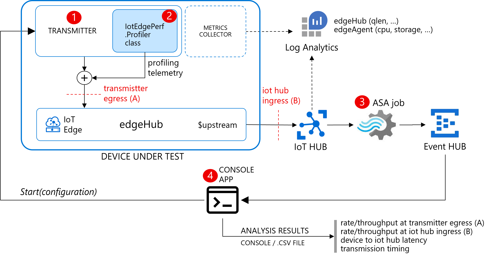
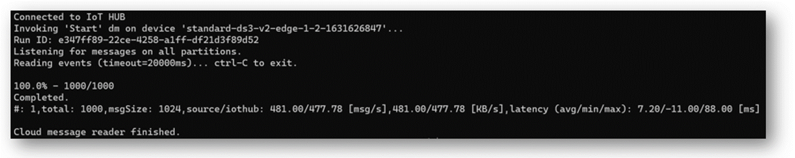

# iotEdgePerf
A framework and a CLI tool to measure throughput and end-to-end latency of an IoT Edge.
Useful for:
* measuring the max rate/throughput and latency achievable
* sizing HW (or VM) to meet the target rate/latency
* optimizing rates/latency by fine-tuning message batching, number of modules/inputs/outputs, ...
* performing long-run tests against target traffic load
* understanding how rate/latency/queue are related



The framework includes:

* a [transmitter](./source/trasmitter) (1) module, to generate traffic
* an [ASA query](./asa/) (4), to measure the ingestion latency and rate
* the [iotEdgePerf](./source/iotEdgePerf) (5) CLI app, to control the transmitter, to analyze the data produced by the ASA job and show the results

## Getting started
Pre-requisites:
* a TEST device (VM or real HW) provisioned with IoT Edge 1.1/1.2
* a linux DEV machine 
* IoT HUB, ASA job, event hub
* optional: log analytics workspace

From the DEV machine: 

Deploy the transmitter module (setting the "MaxUpstreamBatchSize"=200):
```bash
export IOT_HUB_NAME="my-iot-hub"
export DEVICE_ID="edge-device-id"

./deploy-manifest.sh $IOT_HUB_NAME $DEVICE_ID 200
```

Run the test:
```bash
export IOT_CONN_STRING="HostName=xxx;SharedAccessKeyName=service;SharedAccessKey=xxx"
export EH_NAME="iotedgeperf"
export EH_CONN_STRING="Endpoint=sb://xyz.servicebus.windows.net/;SharedAccessKeyName=RootManageSharedAccessKey;SharedAccessKey=xxx"

# test 1: 1000 msg at 100 msg/s, 1KB each 
./iotEdgePerf \
  --payload-length=1024 
  --burst-length=1000
  --burst-number=1 
  --target-rate=100
  -o test.csv

# test 2: 1000 msg at 500 msg/s, 1KB each
./iotEdgePerf --payload-length=1024 
  --burst-length=1000
  --burst-number=1 
  --target-rate=500
  -o test.csv
```

And here's the result:


 


