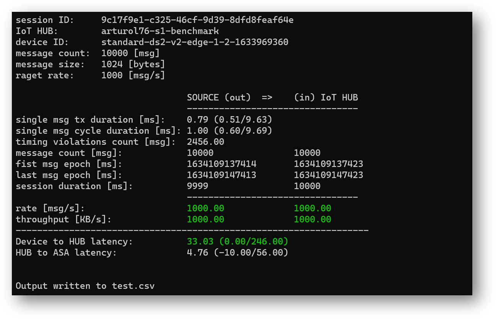

WORK IN PROGRESS
----------------

# iotEdgePerf
A framework and a CLI tool to measure throughput and end-to-end latency of an IoT Edge.
Useful for:
* measuring the rate/throughput at transmitter egress (A) and iot hub ingress (B) along with the A-to-B latency
* sizing HW (or VM) to meet the target rate/latency or assessing the maximum rate/throughput achievable on a given configuration
* optimizing rates/latency by fine-tuning message batching


The framework includes:

* a [transmitter module](source/IotEdgePerf.Transmitter.Edge/) (1), to generate traffic 
  (arlotito/iotedgeperf-transmitter [](https://hub.docker.com/repository/docker/arlotito/iotedgeperf-transmitter))
* an [IotEdgePer.Profiler](source/IotEdgePerf.Profiler/) class (2), ...
* an [ASA query](./asa/) (3), to measure the ingestion latency and rate
* the [IotEdgePer.ConsoleApp](source/IotEdgePerf.ConsoleApp/) (4) CLI app, to control the transmitter, to analyze the data produced by the ASA job and show the results

An example:
```bash
dotnet run -- --payload-length=1024 --burst-length=10000 target-rate=1000
```


# Getting started
Pre-requisites:
* a TEST device (VM or real HW) provisioned with IoT Edge 1.1/1.2
* a linux DEV machine 
* IoT HUB, ASA job, event hub
* optional: log analytics workspace

## Prep the IoT Edge
Log-in into the iot edge device and create the '/iotedge' folder (will be used to bind the edgeHub's folder): 
```bash
sudo mkdir /iotedge
sudo chown 1000 /iotedge
sudo chmod 700 /iotedge
```
At any time you can check the size consumed by the edgeHub queue with:
```bash
du -hd1 /iotedge
```

## Execute the tests

### Deploy the transmitter module (without metrics-collector)

```bash
./deploy-transmitter.sh -n myIotHub -d myEdgeDevice -i arlotito/iotedgeperf-transmitter:0.5.0 -b 200                                       
```
The parameter "-b 200" sets ["MaxUpstreamBatchSize"](https://github.com/Azure/iotedge/blob/master/doc/EnvironmentVariables.md) to 200. 
Change it to fit your needs.

See the help of deploy-transmitter.sh with "-h".

### Deploy the transmitter module with metrics-collector
Export the following ENV vars with your Log Analytics Workspace details:
```bash
export LOG_ANALYTICS_IOT_HUB_RESOURCE_ID="/subscriptions/dcb5e104-5*******a5d686ccf6/resourceGroups/edge-benchmark-hub-rg/providers/Microsoft.Devices/IotHubs/****"
export LOG_ANALYTICS_WORKSPACE_ID="1054c1b0-f*******ac02fbabc"
export LOG_ANALYTICS_SHARED_KEY="EKa3mz2+Shi+***********nb8zVIG7OMsXuwbrTQ=="
export METRICS_COLLECTOR_FREQUENCY=2
```

Then deploy the transmitter module and the metrics collector (adding the flag '-m'):
```bash
./deploy-transmitter.sh -n myIotHub -d myEdgeDevice -i arlotito/iotedgeperf-transmitter:0.5.0 -b 200 -m                                      
```

### Run the tests
```bash
dotnet run -p ./source/IotEdgePerf.ConsoleApp -- \
  --ehName="myEventHubName" \
  --eh-conn-string="Endpoint=sb://xyz.servicebus.windows.net/;SharedAccessKeyName=RootManageSharedAccessKey;SharedAccessKey=xxx" \
  --iot-conn-string="HostName=xxx;SharedAccessKeyName=service;SharedAccessKey=xxx" \
  --device-id="myEdgeDevice" \
  --payload-length=1024 \
  --burst-length=10000 \
  --target-rate=2000 \
  -o test.csv
```

And here's the result:


To make the command line command shorter, some parameters can laso be passed over via ENV variables:
```bash
export DEVICE_ID=__redacted__
export EH_NAME=__redacted__
export EH_CONN_STRING=__redacted__
export IOT_CONN_STRING=__redacted__
export IOT_HUB_NAME=__redacted__
```
and then run with:
```bash
dotnet run -p ./source/IotEdgePerf.ConsoleApp -- \
  --device-id="myEdgeDevice" \
  --payload-length=1024 \
  --burst-length=10000 \
  --target-rate=2000 \
  -o test.csv
```

To get the help:
```bash
dotnet run -p ./source/IotEdgePerf.ConsoleApp -- -h
```


## Optionally build the iotEdgePerf tool
On the DEV machine, build the iotEdgePerfTool as a self-contained binary:
```bash
dotnet publish ./source/iotEdgePerf/iotEdgePerf.csproj -r linux-x64 -p:PublishSingleFile=true --configuration Release -o .
```


