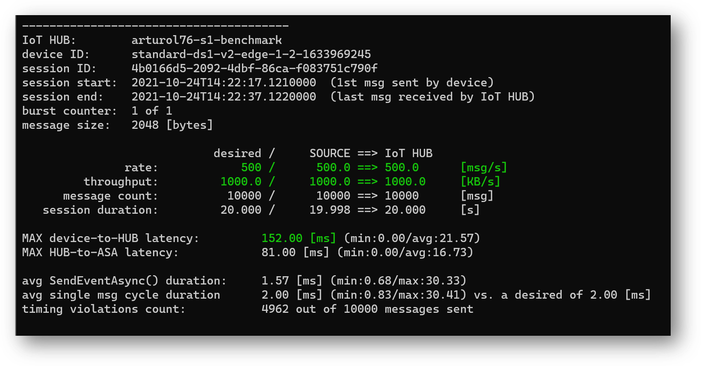

# iotEdgePerf
A framework and a CLI tool to measure throughput and end-to-end latency of an IoT Edge.
Useful for:
* measuring the max rate/throughput and latency achievable
* sizing HW (or VM) to meet the target rate/latency
* optimizing rates/latency by fine-tuning message batching...


The framework includes:

* a [transmitter module](./source/Transmitter/README.md) (1), to generate traffic 
  (arlotito/iotedgeperf-transmitter [](https://hub.docker.com/repository/docker/arlotito/iotedgeperf-transmitter))
* a Profiler class (2), ...
* an [ASA query](./asa/) (3), to measure the ingestion latency and rate
* the [iotEdgePerf](./source/IotEdgePerf) (4) CLI app, to control the transmitter, to analyze the data produced by the ASA job and show the results

An example:
```bash
dotnet run -- --payload-length=1024 --burst-length=10000 target-rate=1000
```


# Getting started
Pre-requisites:
* a TEST device (VM or real HW) provisioned with IoT Edge 1.1/1.2
* a linux DEV machine 
* IoT HUB, ASA job, event hub
* optional: log analytics workspace

## Prep the IoT Edge
Log-in into the iot edge device and create the '/iotedge' folder (will be used to bind the edgeHub's folder): 
```bash
sudo mkdir /iotedge
sudo chown 1000 /iotedge
sudo chmod 700 /iotedge
```
At any time you can check the size consumed by the edgeHub queue with:
```bash
du -hd1 /iotedge
```

## Execute the tests
On the DEV machine (change to match yours):
```bash
export IOT_HUB_NAME="my-iot-hub"
export DEVICE_ID="edge-device-id"
export IOT_CONN_STRING="HostName=xxx;SharedAccessKeyName=service;SharedAccessKey=xxx"
export EH_NAME="iotedgeperf"
export EH_CONN_STRING="Endpoint=sb://xyz.servicebus.windows.net/;SharedAccessKeyName=RootManageSharedAccessKey;SharedAccessKey=xxx"
```

Deploy the transmitter module:
```bash
./deploy-transmitter.sh $IOT_HUB_NAME $DEVICE_ID 200 arlotito/iotedgeperf-transmitter:0.4.1
```
That sets "MaxUpstreamBatchSize" to 200. Change it to your needs.

Run the test:
```bash
dotnet run -p ./source/IotEdgePerf -- \
  --payload-length=1024 \
  --burst-length=1000 \
  --burst-number=1 \
  --target-rate=100 \
  -o test.csv
```

And here's the result:


## Optionally build the iotEdgePerf tool
On the DEV machine, build the iotEdgePerfTool as a self-contained binary:
```bash
dotnet publish ./source/iotEdgePerf/iotEdgePerf.csproj -r linux-x64 -p:PublishSingleFile=true --configuration Release -o .
```


