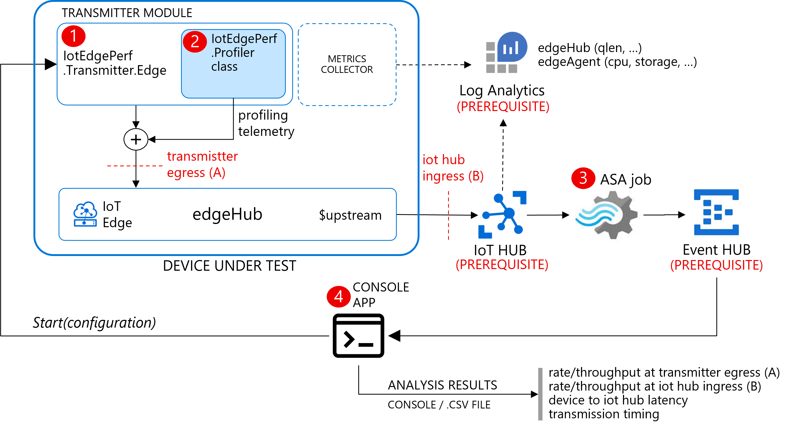

A framework to simulate dataflows in an IoT Edge instance and benchmark:
* the local brokering performance (rates)
* the upstream rate and end-2-end latency



The framework includes:

* an edge solution with:
  * a [source module](./edgeSolution/modules/source) (1), to create the source message stream
  * a [sink module](./edgeSolution/modules/sink) (2), to consume the source message stream and/or propagate it along a pipeline by optionally echoing the input to the output
  * a metrics collector (3), to collect the metrics (edgehub and edgeagent built-in, source and sink modules) and send them to Azure Monitor
* an [ASA query](./asa/) (4), to measure the ingestion latency and rate
* a [console application](./console/) (5), to receive the latency/rate from the ASA job
* a [Jupyter notebook](./jupyter/) (6), as an alternative to the console application, to collect and visualize relevant metrics

> **_TO DO:_** 
> * an ARM template with ASA job + query, Event HUB? 
> * I assume that IoT HUB would be already in place. Maybe we need only CLI to configure the routing?
> * What about the log analytics workspace? 

Both the source and sink modules measure the actual rate and other stats that are emitted via:
* logs
* prometheus metrics (for integration with Azure Monitor)
* messages

This framework is useful for:
* measuring max rates and latency vs HW specs (or VM size)
* sizing HW (or VM) to meet the target rate/latency
* optimizing rates/latency by fine-tuning message batching, number of modules/inputs/outputs, ...
* performing long-run tests against target traffic load
* understanding how rate/latency/queue are related

## Getting started
Pre-requisites:
* IoT HUB, log analytics workspace, ASA job, event hub

Then simply run:
```bash
curl -L https://raw.githubusercontent.com/arlotito/vm-iotedge-provision/dev/scripts/vmedge.sh | bash -s -- \
    -s Standard_DS3_v2 \
    -g edge-benchmark-vm-rg \
    -e 1.2 \
    -n edge-benchmark-hub \
    -d ./edgeSolution/samples/deployment.test1.json
```

It will:
* create a VM of size 'Standard_DS3_v2' in resource group 'edge-benchmark-vm-rg'
* will install IoT Edge 1.2 
* register an edge identity on the 'edge-benchmark-hub' IoT HUB and will configure the IoT Edge instance to use it
* will eventually deploy the 'test1.json' configuration, which is the edge deployment manifest with the desired source/sink modules pipeline and related parameters as ENV variables.

Here's a simple test configuration and the related [deployment.test1.json](deployment.test1.json):


Here's the relevant section of [deployment.test1.json](deployment.test1.json), where you can adjust:
* the source stream parameters (rate, num of messages, ...) (full details in the [source module](./edgeSolution/modules/source) docs)
* your log analytics workspace info in place of `<YOURSHERE>`

```json
      "modules": {
          "source": {
            "version": "1.0",
            "type": "docker",
            "status": "running",
            "restartPolicy": "always",
            "settings": {
              "image": "arlotito/edge-sim-source:0.3.9-amd64",
              "createOptions": "{}"
            },
            "env": {
              "START_WAIT": {
                "value": "10000"
              },
              "BURST_LENGTH": {
                "value": "1500"
              },
              "BURST_WAIT": {
                "value": "10000"
              },
              "BURST_NUMBER": {
                "value": "1"
              },
              "TARGET_RATE": {
                "value": "50"
              },
              "LOG_MSG": {
                "value": "false"
              },
              "LOG_BURST": {
                "value": "true"
              },
              "LOG_HIST": {
                "value": "false"
              },
              "MESSAGE_PAYLOAD_LENGTH": {
                "value": "1024"
              },
              "RATE_CALC_PERIOD": {
                "value": "5000"
              }
            }
          },
          "IoTEdgeMetricsCollector": {
            "settings": {
              "image": "mcr.microsoft.com/azureiotedge-metrics-collector:1.0",
              "createOptions": ""
            },
            "type": "docker",
            "env": {
              "ResourceId": {
                "value": "/subscriptions/<YOURSHERE>/resourceGroups/edge-benchmark-hub-rg/providers/Microsoft.Devices/IotHubs/<YOURSHERE>"
              },
              "UploadTarget": {
                "value": "AzureMonitor"
              },
              "LogAnalyticsWorkspaceId": {
                "value": "<YOURSHERE>"
              },
              "LogAnalyticsSharedKey": {
                "value": "<YOURSHERE>"
              },
              "ScrapeFrequencyInSecs": {
                "value": "2"
              },
              "MetricsEndpointsCSV": {
                "value": "http://edgeAgent:9600/metrics, http://edgeHub:9600/metrics, http://source:9600/metrics"
              }
            },
            "status": "running",
            "restartPolicy": "always",
            "version": "1.0"
          }
        }
      }
```

 


