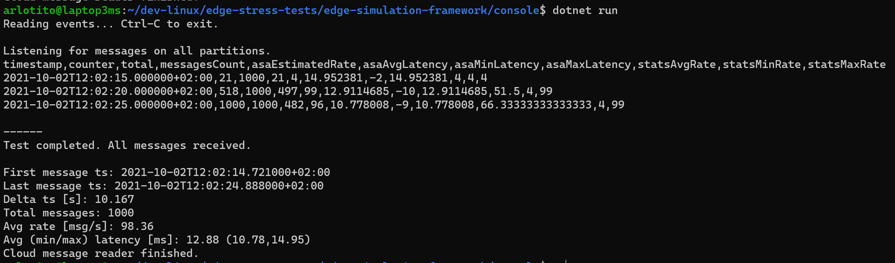

```bash
dotnet run -- -n "<your-EH-name>" -c "<your-EH-conn-string>"
```
(as an alternative to command line options, you can us env vars EH_NAME and EH_CONN_STRING)

Example:
```bash
dotnet run -- -n "rate" -c "Endpoint=sb://arlotitoxyz.servicebus.windows.net/;SharedAccessKeyName=RootManageSharedAccessKey;SharedAccessKey=2az......bg="
```




